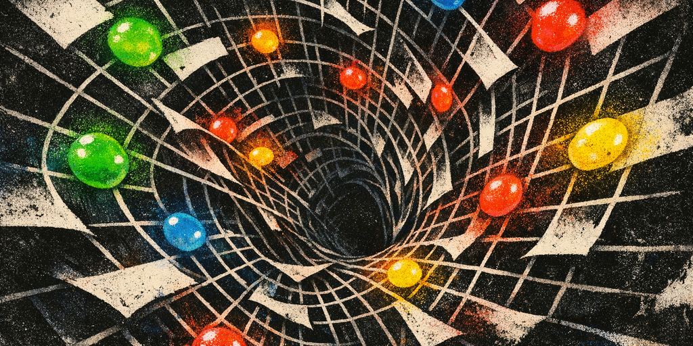
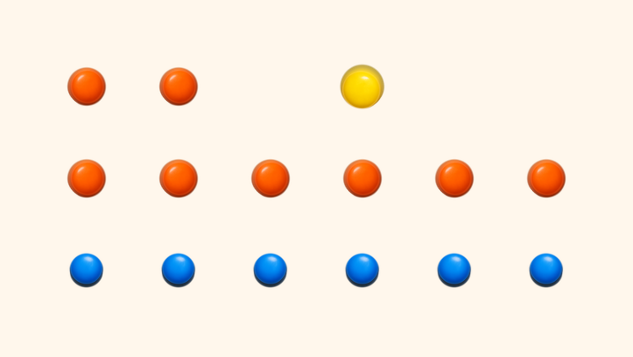
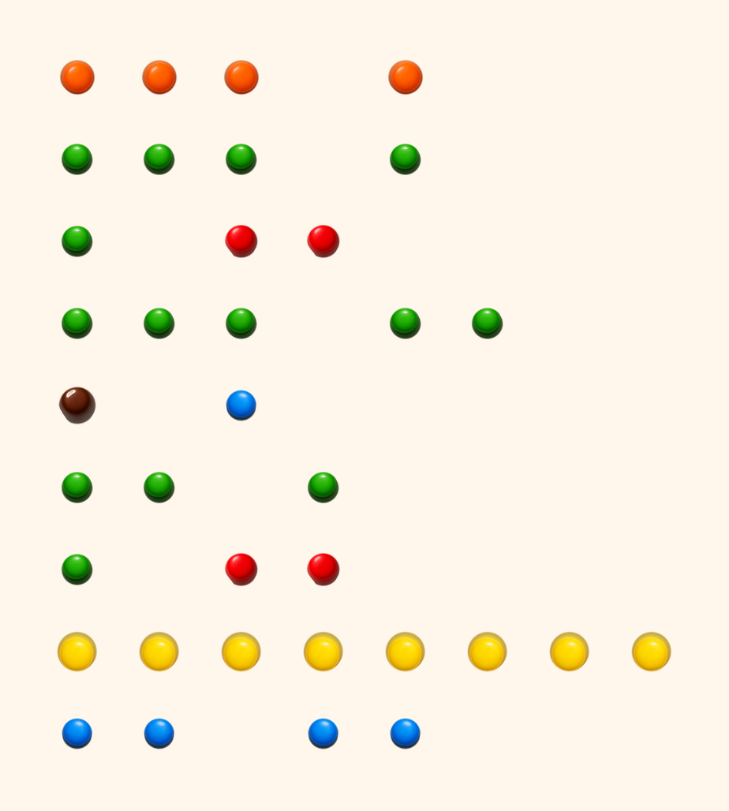

+++
title = "I made a programming language with M&Ms"
description = "I built a tiny programming language where programs are candy grids, complete with a renderer, photo decoder, AST tree, and execution trace."
date = 2026-03-07
slug = "i-made-a-programming-language-with-mnms"

[taxonomies]
tags = ["programming", "compilers", "silly", "slop"]

[extra]
blog = true
no_header = false
og_image = "https://mufeedvh.com/posts/i-made-a-programming-language-with-mnms/mnm-lang-poster-og.jpg"
og_image_type = "image/jpeg"
og_image_width = 1200
og_image_height = 630
+++

{{ slop_meter(percent=31) }}

> What if a little pile of M&Ms on a table was a real program?

I mean literally. Imagine you arrange M&M-like candies into a specific pattern, that pattern is executable code.

Alright story time. Featuring *inline interactive interpreter embedded right inside this post*.

It all started when I spilled a full packet of GEMS{{ sidenote(id="gems", content="GEMS is sort of an Indian version of M&Ms.") }} on the floor cus I opened (ripped?) the packet a bit too hard.

It fell into an interesting pattern that I could only describe as the shape of an arrow.

Random patterns, fractals, interpreting nonsense into structure are hobbies that entice me. I am somewhat of an apophenic when it comes to these things.

The colors, the placements, and the structure of what I saw dropped a silly idea into my minds eye. What if I could write programs with M&Ms. This is the story of one of my _many_ silly little projects.


<div class="center-content">
<p><em>abstract art of m&ms being parsed</em></p>
</div>

{{ toc() }}

Seeing the spilled candy on the floor, a few constraints dawned on me...

- There are only six useful colors.
- A photo is a terrible place to store exact symbolic data.
- Candy is round, glossy, messy, and inconveniently physical.
- Strings are a disaster if you try to cram them into an image.
- If this thing is going to be funny, it still has to actually work.

So I built it.

The result is **MNM Lang**, a tiny programming language where:

- source code is written as runs of six letters: `B G R Y O N`
- those runs compile into a PNG made from candy sprites
- the PNG decompiles back into source exactly
- and a controlled photo decoder can recover programs from mildly skewed images (I hope that works)

There is a CLI, a browser playground, example programs, tests, and a sprite pack
generated specifically for the project.

And this is obviously not a practical language. It is a serious implementation of a silly idea.

<script src="mnm_lang_web_demo.js" defer></script>

## The core problem

If you only have six candy colors, how do you build a language that is:

- easy to place by hand
- easy to read from a photo
- expressive enough to run real examples
- and small enough that the whole bit stays funny?

My answer was: **encode instructions by color family, and encode operands by count.**

That means a token like this:

```mnm
BBB
```

isn’t “three arbitrary blue things.” It means a specific opcode.

And a token like this:

```mnm
RRRR
```

means the integer literal `3`, because operand values are `len(token) - 1`.

That single rule ended up doing a lot of work for me:

- it is easy to author in text
- it is easy to render into image cells
- it is easy to reconstruct from image geometry
- and it feels appropriately ridiculous

You can explain the language to someone in about thirty seconds:

> “Blue clusters are control flow, green is stack and variables, yellow is math, orange is I/O, brown is labels and strings, red is stack shuffling and logic. If you want the number five, use six red candies.”

Whether or not that's intuitive is not a question I can answer at this time.

## Images are bad at text

The earliest fork in the road was strings.

I could have tried to encode text directly into candy layouts. Maybe invent a
micro-alphabet. Maybe use rows of yellow and red as bytes. Maybe do some cursed
base-6 trick.

That would have been technically possible and spiritually awful.

The fun part of the project is the visual structure, not building an OCR-resistant
QR code out of sugar shells.

So I pushed strings and initial variables into a sidecar JSON file.

That means a program has two parts:

1. the visual candy layout in `.mnm`
2. the non-visual runtime data in `.mnm.json`

For example, hello world is:

```mnm
OO Y
OOOOOO
BBBBBB
```

And because the whole bit only works if that text turns into an actual candy
program, here is the compiler output for it:



<div class="center-content">
<p><em>`hello_world`, but in snack form</em></p>
</div>

And its sidecar is:

```json
{
  "strings": ["Hello, world!"],
  "variables": [],
  "inputs": {
    "int": [],
    "str": []
  }
}
```

And because I apparently have no sense of restraint, this page can also run that
exact little program inline:

<div data-mnm-inline-demo data-title="Run hello_world here" data-description="The browser-native MNM Lang runtime renders the candy sheet, then animates output, AST, and trace right inside the post.">
  <textarea class="mnm-demo-source" hidden>OO Y
OOOOOO
BBBBBB</textarea>
  <script type="application/json" class="mnm-demo-sidecar">{"strings":["Hello, world!"],"variables":[],"inputs":{"int":[],"str":[]}}</script>
</div>

That split ended up making the whole system cleaner:

- the image only carries what images are good at: structure
- runtime input can change without moving candy
- the photo decoder does not have to pretend it can read prose from glossy candy

Sometimes the correct answer in a whimsical project is to stop being whimsical
for one layer of the stack.

{{ alterego(content="Says the same guy who thought of synthetically generating an MNIST-like dataset of M&M programs on various different textures to train a model capable of inferring M&Ms on beach sand to running programs. Anywho.") }}

## A language made of six colors

Once strings moved out of the image, the language itself fell into place pretty quickly.

I grouped instructions by color family:

- blue: jumps, calls, halt
- green: push/load/store/dup/pop/inc/dec
- yellow: arithmetic and comparisons
- orange: printing and input
- brown: labels and string operations
- red: swap, rotate, boolean logic

And then I made the first token on every row the opcode.

That gives the language a very physical feel. A line is an instruction. A cluster
of candies is a token. More candies means a different variant.

It is almost closer to arranging game pieces than writing code.

The full programs still look absurd, which I consider a success. This is the
opening stretch of the factorial example:

```mnm
OOO O
GGG G
G RR
GGG GG
N B
GG G
G RR
YYYYYYYY
BB BB
```

Fed through the renderer, that opening section looks like this:



<div class="center-content">
<p><em>this is a real program</em></p>
</div>

If you already know the rules, you can decode that as:

- read integer queue 0
- store into variable 0
- push 1
- store into variable 1
- label 0
- load variable 0
- push 1
- compare `>`
- jump-if-zero to label 1

Which means, yes, I wrote a looping factorial program out of candy.

## The only correct compiler target was an image

If the whole gimmick is “this program is candy,” the compiler cannot stop at an AST.

It has to emit an image.

So the compiler takes normalized `.mnm` source and renders it on a fixed grid:

- one source character per cell
- spaces become empty cells
- cells hold transparent-background candy sprites
- the output is a PNG

That fixed geometry turned out to be a huge win, because it made the reverse
direction almost trivial.

If an image came from the compiler, the decompiler can:

- recover the exact row/column count from the canvas size
- sample each cell
- classify it as blue/green/red/yellow/orange/brown/blank
- strip trailing spaces
- and re-parse the result

That gives an exact round-trip:

<svg class="round-trip-diagram" viewBox="0 0 420 64" xmlns="http://www.w3.org/2000/svg">
  <style>.rt-t{font-family:'JetBrains Mono',monospace;font-size:9px;fill:#666;letter-spacing:0.05em}.rt-icon{fill:none;stroke:#555;stroke-width:1.2;stroke-linecap:round;stroke-linejoin:round}</style>
  <g transform="translate(50,4)">
    <rect class="rt-icon" x="0" y="0" width="24" height="30" rx="1.5"/>
    <line class="rt-icon" x1="5" y1="8" x2="19" y2="8"/>
    <line class="rt-icon" x1="5" y1="13" x2="16" y2="13"/>
    <line class="rt-icon" x1="5" y1="18" x2="19" y2="18"/>
    <line class="rt-icon" x1="5" y1="23" x2="13" y2="23"/>
    <text x="12" y="46" class="rt-t" text-anchor="middle">source</text>
  </g>
  <line x1="100" y1="22" x2="175" y2="22" stroke="#444" stroke-width="1" stroke-dasharray="4 3"/>
  <g transform="translate(198,4)">
    <rect class="rt-icon" x="0" y="0" width="24" height="30" rx="1.5"/>
    <polygon class="rt-icon" points="5,22 10,14 14,19 17,15 19,22" fill="none"/>
    <circle cx="8" cy="10" r="2" class="rt-icon"/>
    <text x="12" y="46" class="rt-t" text-anchor="middle">PNG</text>
  </g>
  <line x1="245" y1="22" x2="320" y2="22" stroke="#444" stroke-width="1" stroke-dasharray="4 3"/>
  <g transform="translate(345,4)">
    <rect class="rt-icon" x="0" y="0" width="24" height="30" rx="1.5"/>
    <line class="rt-icon" x1="5" y1="8" x2="19" y2="8"/>
    <line class="rt-icon" x1="5" y1="13" x2="16" y2="13"/>
    <line class="rt-icon" x1="5" y1="18" x2="19" y2="18"/>
    <line class="rt-icon" x1="5" y1="23" x2="13" y2="23"/>
    <text x="12" y="46" class="rt-t" text-anchor="middle">source</text>
  </g>
</svg>

with no heuristics at all.

In other words: the “compiler” is also a tiny image format.

## I generated the candy sprites with an image model

One of my favorite parts of the project is that I didn’t hand-draw the sprites.

I used [AI image generation](https://github.com/openai/skills/blob/main/skills/.curated/imagegen/SKILL.md){{ sidenote(id="imagegen", content="This is a <a href='https://github.com/openai/skills'>Codex Skill</a> — a reusable capability you can give to Codex for specialized tasks like image generation.") }} to create six M&M-style candy tokens:

- blue
- green
- red
- yellow
- orange
- brown

The raw generations were decent, but not directly usable. They came with a few
annoying traits:

- too much studio backdrop
- a bit of inconsistent shadow
- minor scale differences

So the final asset pipeline became:

1. generate six isolated candies with transparent-background prompts
2. normalize them with a small script
3. crop and center them onto a canonical 128x128 canvas
4. extract palette metadata for the decompiler and photo classifier

Not conceptually. Literally. The checked-in prompt bundle for the sprite pack
looks like this:

```json
{
  "prompt": "a single blue candy-coated chocolate lentil ... isolated on a transparent background",
  "composition": "one candy only, top-down, centered, consistent scale",
  "constraints": "transparent background; no logo; no text; no watermark",
  "out": "blue.png"
}
```

And the normalization script starts by estimating the backdrop and isolating the
largest candy blob:

```python
background = np.median(border, axis=0)
distance = np.linalg.norm(rgb - background, axis=2)
threshold = filters.threshold_otsu(distance)
mask = distance > max(18.0, float(threshold) * 0.9)
return labeled == regions[0].label
```

Then it scales and centers that cutout onto the canonical sprite canvas:

```python
available = CANVAS_SIZE - (PADDING * 2)
scale = min(available / cropped.width, available / cropped.height)
canvas = Image.new("RGBA", (CANVAS_SIZE, CANVAS_SIZE), (0, 0, 0, 0))
x = (CANVAS_SIZE - resized.width) // 2
y = (CANVAS_SIZE - resized.height) // 2
canvas.alpha_composite(resized, (x, y))
```

And finally it writes the palette metadata that the decompiler and photo
classifier both use later:

```python
rgb = array[..., :3][array[..., 3] > 0]
mean_rgb = tuple(int(round(value)) for value in rgb.mean(axis=0))
palette[color[0].upper() if color != "brown" else "N"] = mean_rgb
```

That normalization step mattered a lot more than I expected. If the shadows are
too strong, candies that are supposed to be separate blobs start merging after
blur and perspective transforms. That sounds like a silly implementation detail,
but it is exactly the sort of thing that determines whether “photo decoding” is
real or fake.

Projects like this are fun because the silly part and the engineering part keep
interfering with each other in useful ways.

## I almost talked myself into training a model

When you say “image decoding,” your brain immediately offers to make the project
bigger than it needs to be.

I had the same impulse:

- maybe I should train a tiny classifier
- maybe synthesize candy crops
- maybe build the MNIST-for-M&Ms pipeline

That would be fun. It is also not necessary for v1.

The version I shipped uses deterministic image processing for the photo decoder:

- estimate background color from the border
- segment candy-like foreground blobs
- classify each blob against the canonical six-color palette
- cluster the blobs into rows
- infer spaces from centroid gaps
- re-parse the reconstructed source

This works surprisingly well for the target use case:

- overhead photo
- plain contrasting background
- separated candies
- mild blur
- small rotation or perspective skew

It absolutely does **not** solve “dumped a bag of candy on a messy kitchen table
and took a dramatic iPhone shot.”

## Real example programs are where the joke becomes a language

I didn’t want this to stop at “hello world with candy colors.”

So I added a few examples that push on different parts of the language:

`hello_world`

Pure output. Basically the proof that the whole pipeline exists.

`echo_name`

Uses a string queue and concatenation to greet the input name from the sidecar.

`factorial`

This is where it starts feeling real:

- labels
- variable mutation
- arithmetic
- conditionals
- loops

`fizzbuzz`

Mandatory. Also unexpectedly good at showing off the design because it uses:

- modulo
- branching
- string slots
- repeated output
- a small amount of state

Watching `fizzbuzz` compile into a candy grid and then run correctly is exactly
the kind of payoff I wanted from the project.

At that point it stops being “a cursed novelty syntax” and starts being “okay,
this is a legitimate little VM that happens to look like a snack.”

## The browser playground made it feel like a real toy

The CLI is the serious interface:

- compile
- decompile
- run
- serve
- list examples

But the browser playground is what makes the repo inviting.

It lets you:

- load a shipped example
- edit source
- edit sidecar JSON
- render the candy-sheet preview
- run it immediately
- upload an image and decode it back into source

I also added two views that made the whole thing feel much more like a real
language toolchain instead of a cursed renderer demo:

- a tree-formatted AST showing what the parser believes each candy row means
- a tree-formatted execution trace showing which branches the interpreter
  actually took at runtime

For a tiny program like `hello_world`, the AST stays pleasantly readable:

```text
Program (3 instruction(s))
|-- labels
|   `-- (none)
`-- instructions
    |-- [0] PRINT_STR @ line 1 (string[0] from Y)
    |   `-- source: OO Y
    |-- [1] NEWLINE @ line 2
    |   |-- source: OOOOOO
    |   `-- operands: (none)
    `-- [2] HALT @ line 3
        |-- source: BBBBBB
        `-- operands: (none)
```

And the execution trace is exactly the kind of thing I wanted once the language
had loops and branches. Here is a clipped excerpt from `factorial`, right around
the point where the loop either keeps going or breaks out:

```text
Execution
|-- [step 8] [ip=7] GT @ line 8
|   `-- state: stack=[1] vars=[5, 1]
|-- [step 9] [ip=8] JZ (label[1] from BB) @ line 9
|   |-- branch: fallthrough -> instruction[9]
|   `-- state: stack=[] vars=[5, 1]
...
|-- [step 52] [ip=7] GT @ line 8
|   `-- state: stack=[0] vars=[1, 120]
|-- [step 53] [ip=8] JZ (label[1] from BB) @ line 9
|   |-- branch: taken -> label[1] @ instruction[15]
|   `-- state: stack=[] vars=[1, 120]
```

That same tree output now shows up in both the CLI and the browser UI, which is
nice because candy code is way funnier once you can also inspect it like a real
compiler/runtime pipeline.

So here is the same idea, but actually live:

<div data-mnm-inline-demo data-title="Run factorial inline" data-description="A richer inline demo with loops, state mutation, branch decisions, the candy-sheet render, and the full trace tree.">
  <textarea class="mnm-demo-source" hidden>OOO O
GGG G
G RR
GGG GG
N B
GG G
G RR
YYYYYYYY
BB BB
GG GG
GG G
YYY
GGG GG
GGGGGGG G
B B
N BB
GG GG
O
OOOOOO
BBBBBB</textarea>
  <script type="application/json" class="mnm-demo-sidecar">{"strings":[],"variables":[0,0],"inputs":{"int":[[5]],"str":[]}}</script>
</div>

## We need tests

I designed the interpreter but the code is mostly written by GPT 5.4 XHigh via Codex.

{{ alterego(content="'design'... As in, he described the design in natural language, plain english.") }}

And vibe coding calls for tests cus what if it [reward hacked](https://en.wikipedia.org/wiki/Reward_hacking){{ sidenote(id="reward-hacking", content="Reward Hacking is when an AI optimizes for the metric you gave it rather than the goal you meant — passing tests without actually solving the problem.") }} my idea into existence?

So I wrote tests for the actual guarantees:

- parser validation
- runtime semantics
- example golden outputs
- exact source/PNG/source round-trips
- synthetic photo decoding with blur, rotation, and perspective skew
- API behavior
- a playground-style smoke flow
- sprite asset sanity checks

One of the bugs I hit was that the photo decoder accidentally treated fully opaque
RGB images as if their alpha channel meant foreground everywhere, which turned
the entire canvas into a single blob. That sounds obvious once you know it, and
it is exactly the kind of mistake I wanted to catch.

Another was that the sprite normalization kept too much drop shadow, which caused
nearby candies to merge after blur. Again: a ridiculous bug, but a real one.

The tests are what separate “look, I rendered candy once” from “this is an actual
system with constraints and failure modes.”

## The best part of the project is the tradeoff it forces

Every joke project has a point where you decide whether you are going to protect
the joke or protect the implementation.

MNM Lang kept forcing me to do both.

That is how you end up with rules like:

- blue cluster width decides which branch instruction you mean
- red run length encodes integer literals
- strings live in JSON because candy OCR is a terrible life choice
- compiled PNGs are exact but photos are “controlled” on purpose

None of that is language design orthodoxy.

All of it is completely justified by the premise... I tell myself.

## If you want to try it

**GitHub**: [mufeedvh/mnmlang](https://github.com/mufeedvh/mnmlang)

The [repo](https://github.com/mufeedvh/mnmlang) includes:

- the interpreter
- the photo decoder
- the candy sprites
- example programs
- the local playground

The best first command is probably:

```bash
uv run mnm serve
```

Load `fizzbuzz`, render it, and look at the compiled PNG for a second.

It really does look like a programming language you could pour out of a bag.

So stupid.

Oh and I have more silly projects. This is `#1` of the series. Tune in for how I reverse engineered my keyboard's driver binary to play snake with the backlights while my agents run in the background.

<div class="cta-row">
{{ button(text="Link to this article", icon="fa-solid fa-link", id="share-button", onclick="share_button();", button_class="cta-button") }}

{{ button(text="Follow me on", icon="fa-brands fa-x-twitter", id="follow-button", onclick="twitter_follow();", button_class="cta-button") }}
</div>
